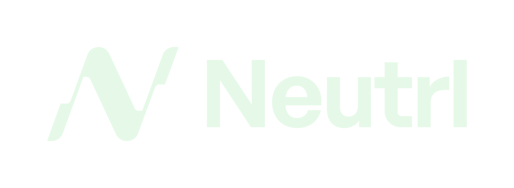
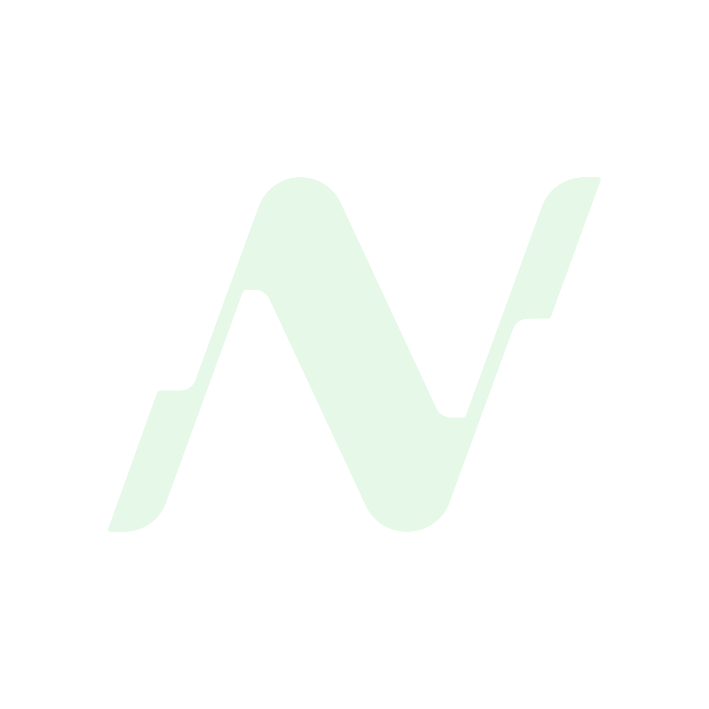
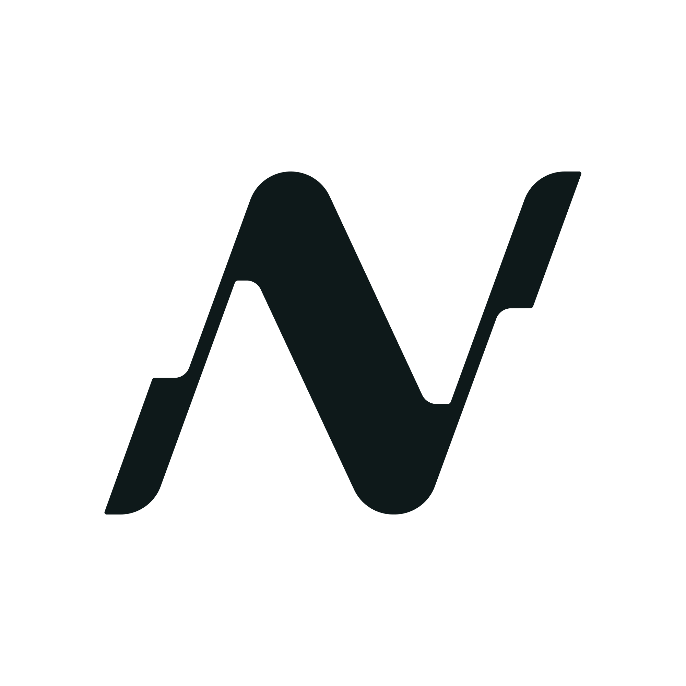
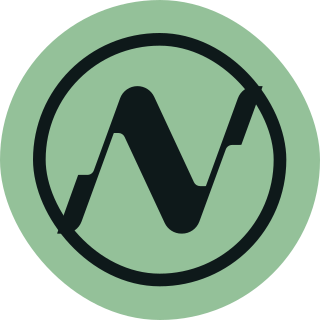
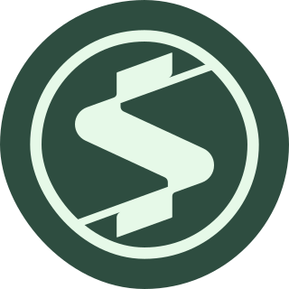
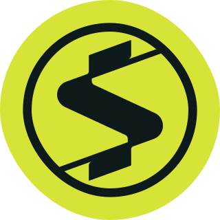

# Brand Guidelines

Version 1.0

## Table of Contents

- [01 Brand Marks](#01-brand-marks)
- [02 Color](#02-color)
- [03 Typography](#03-typography)
- [04 Illustrations](#04-illustrations)
- [05 Applications](#05-applications)

## 01 Brand Marks

### The Logo

Our logo, composed of a distinct Mark and Wordmark, stands as the cornerstone of our visual identity and holds the prime position in our brand's graphic representation. Its elements have been intricately crafted, designed to work together seamlessly to offer an aesthetically balanced portrayal of our brand.

The consistency in the application of our logo is vital to the preservation and enhancement of our brand identity. It acts as an immediate signifier, communicating our essence and values at a glance.

To ensure the continuity of this recognition, it's crucial to refrain from any alterations, modifications, or redrawing - thus maintaining the logo's original integrity.

### The Mark

Our mark is a stylized letter N, formed with curved, organic lines inspired by the flowing shape of a delta chart—a nod to the brand's connection to financial markets and data movement. This fluid form reflects agility, growth, and adaptability, key qualities in the financial and crypto landscape.

To preserve its integrity, only the official digital artwork should be used. Do not redraw, distort, or alter the logo in any way.

### Logo Color Options

Always ensure high contrast between the logo and its background. Use the appropriate logo variation to maintain sufficient contrast, ensuring the logo is fully visible and stands out clearly.

### Black & White Logo

Whenever possible, use the colored logo versions as outlined above. However, for monochrome applications, such as black-and-white print materials where color is not an option, the black or white logo versions should be used instead.

### Exclusion Zone & Minimum Size

The purpose of the exclusion zone is to preserve the legibility and impact of our Logo by creating a clear space that separates it from any competing visual elements, such as text or supporting graphics. This zone serves as a minimum safe distance, guaranteeing that our Logo has ample room to make a powerful statement.

The size of the exclusion zone is determined by half the height of the Logo, as denoted as 'x' in the accompanying diagram. If the Symbol is used instead of the full Logo, the same exclusion rules apply, with the Symbol having an exclusion zone equal to half its own height.

Minimum sizes:

- Digital: 24px
- Print: 7mm

### Logo Misuse

Maintaining the consistent appearance of our Logo is of utmost importance. It is crucial to avoid misinterpretation, modification, or additions to the Logo.

**Do not:**

- Stretch the logo
- Outline the logo
- Rotate the logo
- Use unapproved colors
- Add gradient to the logo
- Apply shadows or effects
- Change the components' relationship
- Recreate the artwork
- Use the logo on backgrounds with insufficient contrast

### Token Logos

To reinforce Neutrl's brand identity, each token logo is built using the same visual language as the 'N' from Neutrl's primary logo. This approach ensures visual consistency and strengthens brand recognition across the entire product line.

## 02 Color

### Brand Color

The primary colors form the foundation of our brand's visual identity, setting the tone and mood for all communications.

Our core palette features shades of green, complemented by a vivid yellow-green highlight color. The green tones convey a sense of balance, growth, and neutrality, while the highlight color adds boldness and energy. Together, they express the brand's personality and create a strong visual anchor across all design materials.

#### Primary Colors

- **Dark**

  - HEX: #0E191A
  - RGB: 14/25/26
  - CMYK: 46/4/0/90

- **Neutrl Green**

  - HEX: #2E4D40
  - RGB: 46/77/64
  - CMYK: 40/0/17/70

- **Light Green**
  - HEX: #94C199
  - RGB: 148/193/153
  - CMYK: 23/0/21/24

#### Secondary Colors

- **Dark 200**

  - HEX: #1E2E2A
  - RGB: 30/46/42
  - CMYK: 35/0/9/82

- **Light**

  - HEX: #E6F9E8
  - RGB: 230/249/232
  - CMYK: 8/0/7/2

- **Dark 300**

  - HEX: #1F3A33
  - RGB: 31/58/51
  - CMYK: 47/0/12/77

- **Highlight**
  - HEX: #D6E438
  - RGB: 214/228/56
  - CMYK: 6/0/75/11

## 03 Typography

### Brand Typeface

Our brand typeface is Host Grotesk. Host Grotesk is a uniwidth sans serif variable font for modern user interfaces. It features uniform letter widths and spacing across all weights and corresponding italics, ensuring seamless adaptability without compromising layout consistency.

Available weights:

- Regular
- Medium
- SemiBold
- Bold
- ExtraBold
- Light
- All weights include italic variants

### Type Hierarchy

#### Eyebrow

- Font: Host Grotesk / Bold
- Size: 12px
- Line height: 120%
- Letter spacing: 10%

#### Headline

- Font: Host Grotesk / Regular, Italic
- Size: 60px
- Line height: 105%
- Letter spacing: -3%

#### Subtitle

- Font: Host Grotesk / Regular
- Size: 48px
- Line height: 105%
- Letter spacing: -3%

#### Body 1

- Font: Host Grotesk / Regular
- Size: 20px
- Line height: 120%
- Letter spacing: -2%

#### Body 2

- Font: Host Grotesk / Regular
- Size: 16px
- Line height: 120%
- Letter spacing: -2%

#### CTA

- Font: Host Grotesk / Bold
- Size: 14px
- Line height: 120%
- Letter spacing: 5%

## 04 Illustrations

### Folded Paper Grid

Neutrl's illustration system reflects its values of sophistication, clarity, and growth. Using shades of green, solid colors, and subtle grid patterns, we create visual depth that signals trust and stability. The isometric perspective adds transparency and technical precision, making complex systems feel clear and accessible.

Our hero illustration, the Folded Paper Grid, is inspired by yield curves and performance graphs. It symbolizes steady growth, compounding returns, and the structured momentum at the core of Neutrl's ecosystem.

### Isometric Illustrations

We use an isometric-style illustration designed to visualize transparency. The token is shown with its inner layers exposed to represent how Neutrl works under the hood; open, structured, and intentional.

Use clean lines, layered depth, and a fixed isometric perspective to show the internal components clearly. Keep the color palette aligned with Neutrl's brand colors, and maintain a sense of technical precision without clutter.

## 05 Applications

### Social Media Assets

Our social media profile pictures are available in both light and dark variants, with squared and rounded options:

#### Light Variant

- Squared: `neutrl-pfp-light-squared.jpg`
- Rounded: `neutrl-pfp-light-rounded.jpg`

#### Dark Variant

- Squared: `neutrl-pfp-dark-squared.jpg`
- Rounded: `neutrl-pfp-dark-rounded.jpg`

### Background Assets

The brand background (`bg-brand.png`) is available for use in presentations, social media posts, and marketing materials. Always maintain the original aspect ratio when scaling.

---

For any questions regarding brand asset usage, please contact the brand team.
